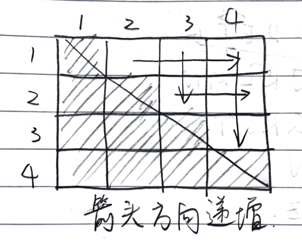

# ARTS 001

* [A: Two Sum](#a-two-sum)
* [R: Domain Driven Design](#r-domain-driven-design)
* [T: Sed](#t-sed)
* [S: 应该把任务分配到人还是让大家来自由选任务？](#s-应该把任务分配到人还是让大家来自由选任务)

## A: Two Sum

> Given an array of integers, return **indices** of the two numbers such that they add up to a specific target. 
>
> You may assume that each input would have **exactly** one solution, and you may not use the *same* element twice.

### Solutions

**Brute Force**

The brute force way is to traverse each pair in two nested loops.

* Time:  $O(n^2)$
* Space:  $O(1)$

**One Pass with Hash Table**

The reason why we need a second nested loop is that we don't remember the values we have gone through. We can simply store the difference and its index in a hash map. For example, when going through the array of `[2, 7, 11, 15]` and we want the target of `18`, we store a map like `{16: 0, 11: 1, 7: 2, 3: 3}`.

* Time: $O(n)$
* Space: $O(n)$

```java
public int[] twoSum(int[] nums, int target) {
    Map<Integer, Integer> m = new HashMap<>();
    for (int i = 0; i < nums.length; i++) {
        if (m.containsKey(nums[i])) {
            return new int[] {m.get(nums[i]), i};
        }
        m.put(target - nums[i], i);
    }
    throw new RuntimeException("Unable to find a solution!");
}
```

**Sort and Two Pointers**

If the array is sorted, we can identify there is some extra work using the brute force. Take the `[2, 7, 11, 15]` as an example.

| #    | Iterations               | Min          | Max          |
| ---- | ------------------------ | ------------ | ------------ |
| 1    | [2, 7], [2, 11], [2, 15] | 2 + 7 = 9    | 2 + 15 = 17  |
| 2    | [7, 11], [7, 15]         | 7 + 11 = 18  | 7 + 15 = 22  |
| 3    | [11, 15]                 | 11 + 15 = 26 | 11 + 15 = 26 |

In row #1, if we know the target is 18 which is larger than the max 17, then we don't need to go through the pairs with 2 in it at all. The question is how we should start the search?

A way to think about it is that we can visualize it below. If we have two pointers and point them to the first and last item respectively, then we can starting from the "middle", and search like it's a tree, 



Note that the question asks us to return the indices, so we still need to copy the array.

Also note that we cannot use a hash table to store a value-to-index map, since there maybe duplicates. (Even though it says there is exactly one solution, we can still have something like `[5, 5]` with target `10`).

* Time: $O(nlogn)$
* Space: $O(n)$

```java
public int[] twoSum(int[] nums, int target) {
    int i = 0;
    int j = nums.length - 1;
    int[] numsSorted = Arrays.copyOf(nums, nums.length);
    Arrays.sort(numsSorted);
    while (i < j) {
        int sum = numsSorted[i] + numsSorted[j];
        if (sum > target) {
            j -= 1;
        } else if (sum < target) {
            i += 1;
        } else {
            // got the solution, find the original indices
            Integer idx1 = null;
            Integer idx2 = null;
            for (int p = 0; p < nums.length; p++) {
                if (idx1 == null && nums[p] == numsSorted[i]) {
                    idx1 = p;
                } else if (idx2 == null && nums[p] == numsSorted[j]) {
                    idx2 = p;
                }
            }
            return idx1 < idx2 ? new int[] {idx1, idx2} : new int[] {idx2, idx1};
        }
    }
    throw new RuntimeException("Unable to find a solution!");
}
```

### Follow up

Q1: What if we don't need to return the indices, just the value of the numbers?

Q2: What if it's not about adding up to a target; instead we want the difference of two numbers equals a target?

Q3: Find the number of pairs that have sum larger than a target?


## R: Domain Driven Design

最近我在我们组的 integration test 里用了 [cucumber](https://docs.cucumber.io/) 框架。这个框架是根据 DDB 的理念而设计的，但我其实并不是特别理解什么是 DDB. 读了两篇文章：

* [Domain Driven Design for Services Architecture](https://www.thoughtworks.com/insights/blog/domain-driven-design-services-architecture)
* [Domain-Driven Design – What is it and how do you use it?](https://airbrake.io/blog/software-design/domain-driven-design)

第一篇文章的例子很有帮助，让我有了初步的理解。大概就是设计的时候从 domain logic （其实就是我们常说的 bussiness logic）出发，根据不同的组成部分，找出 Bounded Context，然后给每个 subdomain 定义出 model。

第二篇文章定义了很多概念，我觉得比较好的部分是分析了 DDB 的优缺点。

我觉得想要更加深入理解 DDB，还是得读读 [Eric Evans 的书](https://book.douban.com/subject/1629512/)。Martin Fowler 大神在解释 [BoundedContext](https://martinfowler.com/bliki/BoundedContext.html) 时说，"It isn't the easiest read in the software literature, but it's one of those books that amply repays a substantial investment."


## T: Sed 

之前需要从一堆文件里提取一些关键词。比如

```
one.txt: Hello:"World"
two.txt: Hello:"Universe"
```

我想从这些文件里提取 Hello 后面双引号内的内容。一般习惯用grep，但grep只能返回 matching text，就是会把 Hello 也返回回来，不像一般的正则表达式可以返回特定的 “capturing group“。Google 了好久都没有找到解决方案，很多人倒是说可以用其他工具，比如 sed 或者 awk. 于是这里我先学学 sed.

> Tutorial: [The Basics of Using the Sed Stream Editor to Manipulate Text in Linux](https://www.digitalocean.com/community/tutorials/the-basics-of-using-the-sed-stream-editor-to-manipulate-text-in-linux)

**Basic usage**

```
sed [options] commands [file-to-edit]
```

**Printing lines**

`sed -n '1,5p' file` - prints the first 5 lines.

* `'p'` - print command
* `-n` - suppress automatic printing, otherwise will print each line twice to console
* Or use offset `sed -n '1,+p' file`

**Deleting lines**

 `sed '1~2d' BSD` - deletes every other lines starting with the first.

* `sed` will print everything that's not deleted.
* Save edits: `sed '1~2d' file > everyother.txt`

**Subtituting Text** with regular expressions

 `'s/old_word/new_word/'`

* `s` is the subtitue command.

* You can also use other characters to delimit the fields.

  * ```
    echo "http://www.example.com/index.html" | sed 's_com/index_org/home_'
    => http://www.example.org/home.html
    ```

* Don't forget the final delimiter.

* By default "s" command operates on the first match in a line and then moves to the next line.
  * Use "g"  flag for every occurance - `sed 's/on/forward/g' file`

**Referencing Matched Text**

Use escaped parentheses to group sections of matched text. e.g. the first parentheses group can be referenced with "\1", the second with "\2" and so on.

回到最开始的问题，我们就可以这样解决：

```
cat * | sed 's/Hello:"\(.*\)".*/\1/'
```

* 需要在最后还加上 `.*`，否则 sed 还会把没有match的部分给打出来

下次学学 awk 的基本用法。

## S: 应该把任务分配到人还是让大家来自由选任务？

我想聊聊一个工程团队里如何给工程师分配任务的问题，因为我们组的这个问题让我很头疼。

在我入职的前几个月里，我们组的任务分配流程大致是这样的：先把所有任务一条一条列出来，然后工程师团队开会讨论每个任务需要多少天，接着 TPM 会做一个项目管理表格，一般情况下把任务分配给最熟悉的人（当时基本上一个人管一个 service），然后会看每个人的 workload，再平均一下，每周会过一遍任务进度。

后来换老板后，我们组开始实践 scrum process. Scrum本身非常好，不过 scrum 的细节上给了实践者很多自由，比如在如何分配任务上。老板觉得先前的方法每个人的 domain knowledge 太多了，比如某个人很熟悉自己开发的 service，而别人都不太了解，这样子有点 "single point of failure" 的意思，就是当这个人走了之后会对整组造成比较大的问题。于是他决定不给每个人分配任务，而每个 sprint 让大家去选自己感兴趣的任务来做。

可渐渐的我发现问题挺大的。本来想通过 “让大家选自己感兴趣的任务来做” 来提高大家的积极性，可是有些人反而没有了积极性，或者说有些人在这种情况下的贡献非常少。我觉得原因主要是没有了 ownership 和 incentive。因为没有落实到人，积极性不高的人会选择少干点活，因为反正总有积极的人会多做点；久而久之，他干的活越少，他会越觉得对任务不感兴趣，因为他对很多事情都不了解，所以他会更不愿意做事情，造成一个恶性循环。（这个恶性循环的部分是我推测的，因为我发现最近一次 sprint 很多任务都是跟我之前做的事情有关，而恰恰是这些任务没有完成）。

其实这样写出来，我突然意识到问题的根本并不在「让大家去选择自己感兴趣的来做」这件事上，而在于「做多做少没区别」。我 mentor 将这个比喻为大锅饭，干多干少、干好干坏都不影响工资分配，从而造成了严重的平均主义。这么说来我们组的问题在于我们没有去分析为什么没做完，为什么有些人做得太少。

不过话说回来，这并不是一件容易事。我们总不可能在 sprint retrospective 上把每人完成的任务量列出来，然后指责事情做得少的人。我感觉老板也很难直接指责员工效率不高，说你做得比别人少太多。而如果我们提前分配好了任务，如果某人任务没做完，拖累了整个组的进度，这是所有人都能看到的，没完成的人是会有压力的。所以还是得提前分配好任务？

于是我都把自己说晕了。我打算下周找老板聊一聊这个问题。

---

Answers to the follow up questions

A1: The third solution will be $O(1)$ in space. For the second solution, we can replace the hash table with a hash set.

A2: Hash table solution works. If it's sorted, we can use two pointers with them both pointing the first element (or both pointing to last). If starting from the first element, increment the second pointer if the value is smaller than target, otherwise increment the first pointer.

A3: Two pointers. If the value is smaller the target, increment the first pointer; otherwise adding the elements on the right of the first pointers to the result, and then decrement the second pointer.

